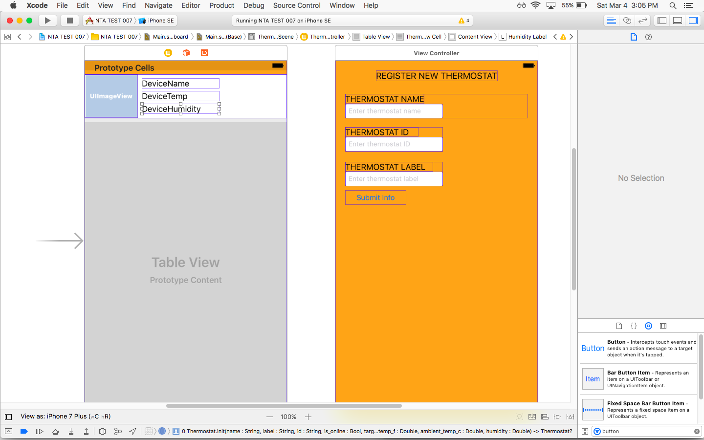

# capstone
Capstone Project Repository

This document contains usage information for the NEST THERMOSTAT ANALYZER mobile application.

This application is simply a test application to begin learning the Swift programming language, 
and the IOS development framework. 

Presently the application contains a few interface components. Ideally the application would 
take user input from the register thermostat view, then add a new cell object to the table view
based on the Thermostat object the user just registered. Some bugs prevent proper display of all cells.

more on this to come...
